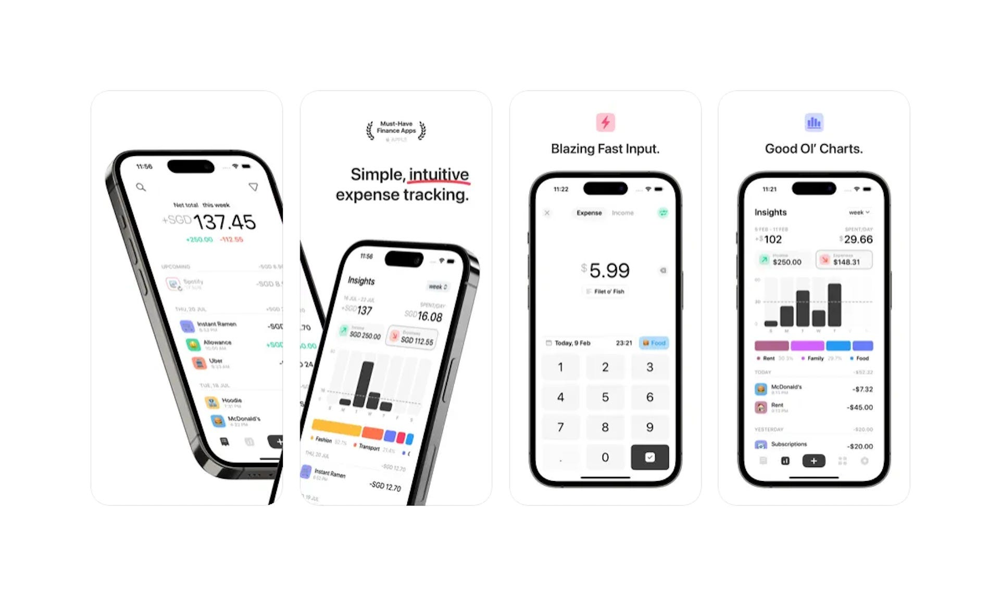

Goededag and welcome to the third issue of the Tiny Sparks newsletter!

If you just stumbled upon that greeting, it means “good day” in Flemish (a Dutch dialect spoken in a region of Belgium). You’ll find out very soon why I choose that language (or have already figured it out, it’s not hard 😉).

I hope you’re enjoying the summer so far! I certainly do. Although it’s more the mornings and the evenings that do it for me, since during the day, it’s not really pleasant to be outside. So right now, I’m sitting next to a fan while typing these words. I hope you have one next to you as well, or live near a cool pool.

With that being said, let’s dive into edition number three (one of my lucky numbers) of Tiny Sparks:

---

## 🗓️ Personal Updates

Here’s a quick rundown of the things that happened in the past two weeks:

- Who might have guessed it from the title, I was on vacation (and am sadly already back home now). Together with my girlfriend, I visited Belgium. We had our “home-base” aka Airbnb in Ghent and also visited Brussels and Antwerpen. It was beautiful, so I thought I could include one thing to do for each city, should you ever visit one (you definitely should!):
  - **Ghent:** A historical boat tour through the canals. You’ll learn a lot about the (medieval) history of the historical heart of Flanders.
  - **Brussels:** Visit the House of European History. It’s a free museum right next to the European Parliament that is packed with interesting facts and anecdotes from Europe’s (not just the EU’s) past.
  - **Antwerpen:** Take a look at the Central Station. It’s the most beautiful train station I’ve ever seen and really worth a visit:

- Obviously, I took some pics on the trip and uploaded a small selection over on my [/photos](https://dominikhofer.me/photos?ref=tiny-sparks) page…
- …but also [reflected on my dilemma regarding taking too many photos and not really experiencing the moment](https://dominikhofer.me/capturing-vs-living?ref=tiny-sparks).
- Since I’m still in the process of [building my Forever Diary](https://dominikhofer.me/building-a-forever-diary?ref=tiny-sparks) but figured, I don’t have enough knowledge of Laravel Livewire, I’m currently following [Josh’s TALL-Stack Tutorial](https://youtu.be/Ul3sfSDEt9U?ref=tiny-sparks). I’m enjoying it so far and learning a ton.

---

## 🔮 Tool Recommendation

This week, I’m recommending you a handy little iPhone app (sorry Android peeps, unfortunately it only exists on iOS) that has become the backbone of my financial life (or my overview of it). Well, maybe apart from Microsoft Excel.

It’s [Dime](https://apps.apple.com/us/app/dime-budget-expense-tracker/id1635280255?ref=tiny-sparks), the best, and most beautiful budget and expense tracker out there. I’ve been using it for over a year now, and it really makes keeping track of your expenses (and also income) a breeze. It’s minimalistic and made by a great [indie dev](https://rafaelsoh.com/?ref=tiny-sparks).

The app is [open source on GitHub](https://github.com/rarfell/dimeapp?ref=tiny-sparks) and 100% free (although you should definitely leave a tip if you can).

---

## 📚 Content Piece

A recent podcast discovery of mine is “[If Books Could Kill](https://www.ifbookspod.com/?ref=tiny-sparks)”. Every two weeks, two guys talk about “the airport bestsellers that captured our hearts and ruined our minds.” And it’s just great.

Partly because the chemistry between the two hosts is excellent, but also, it debunks some of the most famous PopSci and self-help books out there and does a fantastic job at doing so.

One episode I can recommend is the one about “[The 4-Hour Workweek](https://pca.st/jb6eozje?ref=tiny-sparks)”, a book I actually own but have always found equal parts inspiring and douchey. Now I know exactly why.

---

Well, that’s it already, thanks for sticking around. If you have some feedback, a recommendation of your own or just want to say hi, don’t hesitate to reach out! All the contact options are listed over on my [/hello](https://dominikhofer.me/hello?ref=tiny-sparks) page.

And if you enjoyed this particular issue, consider forwarding it to your friends. That would mean a lot.

See you in two weeks!

Cheers ✌️

Dominik
