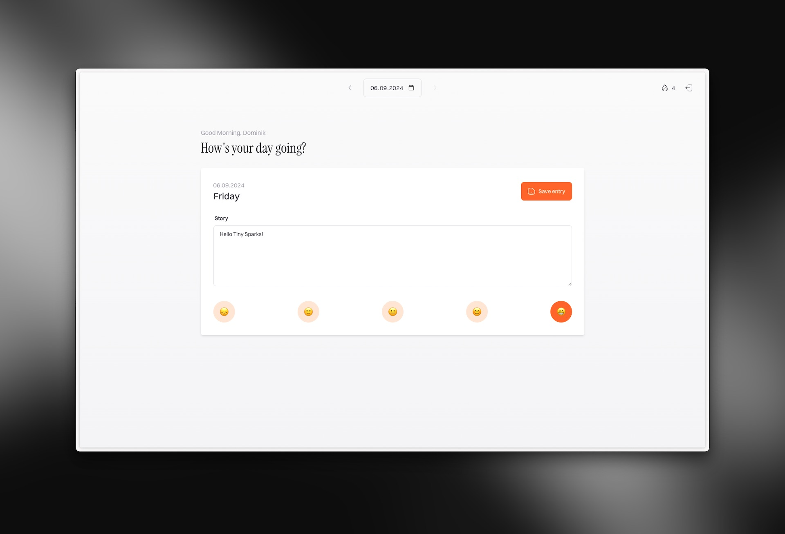

Hi and welcome back to Tiny Sparks!

Every so often, you do something and then immediately afterward know that it was the wrong decision. Robert recently [wrote about this feeling as well](https://birming.com/oops-did-again/?ref=tiny-sparks). And that’s how I felt about my newsletter-move to WordPress, that I so proudly announced in the last issue.

As you can see, this newsletter is now entirely hosted on my website. And if you’re subscribed to it via e-mail, you just got the link to it. But don’t worry, this newsletter isn’t going anywhere. It’s just transforming into a sort of [weeknote](https://tracydurnell.com/2024/07/30/using-personal-weeknotes-as-a-tool-for-attention/?ref=tiny-sparks), that you can still get reminders for via e-mail. 

The benefits of this whole switcheroo are:

1. The issues now exactly fit into the whole vibe of the website
2. All my content is in one place and
3. You can now also read this newsletter in your RSS reader as well (which you definitely should, RSS is great[^1]!)

Enough about the technical side of this newsletter (it’s hopefully the last time for a while) – let’s dive into this week's issue:

---

## 🗓️ Personal Updates

Here’s a quick rundown of the things that happened in the past two weeks:

I ran the **“Stadtlauf” in Thun**. Another 10k race in the books, that serves as preparation for my main 10k in autumn. The race took place on a warm summer evening, and it was just such a great feeling, being surrounded by other runners and dashing through the beautiful city of Thun. You can see the result on my [/races](https://dominikhofer.me/races?ref=tiny-sparks) page.

**Laracon US** took place, which means my YouTube feed was full of great talks and videos being uploaded left and right. [Taylor announced the new changes for the Framework](https://youtu.be/AwWepVU5uWM?ref=tiny-sparks), which make me very confident that it was the right choice to learn it! I also took advantage of the discount happening over at **Laracasts** and bought the annual membership. I’m currently checking out various courses, especially the one by Joe Tannenbaum on [building TUIs](https://laracasts.com/series/cli-experiments?ref=tiny-sparks) has been great so far!

Speaking of Laravel, I finally made some progress on **Zeitlos**, yay. Here is how the app looks right now:

It is fully functional and has all the main features like authentication, the ability to add and edit entries, saving them (encrypted, obviously) and even streaks.

I’ve been using it for the past few days myself, and it does its job so far. I’m gonna add the remaining MVP features soon (like the “on this day” feature), so v1 is feature complete.

The app is already live at [zeitlos.linea.studio](https://zeitlos.linea.studio?ref=tiny-sparks). Signing up is not possible for everyone yet, but if you’re reading this, [reach out to me](https://dominikhofer.me/hello?ref=tiny-sparks) and I’ll whitelist your email address!

I’m also building a small Laravel application at work, I hope I can share more about it soon!

Last but not least, here are the **blog posts** I’ve published since the last newsletter – in case you missed any:
- [Implement a WebFinger endpoint in Astro](https://dominikhofer.me/webfinger-astro?ref=tiny-sparks): A technical post about how I made my Website more discoverable on the Fediverse.
- [Why I write](https://dominikhofer.me/why-i-write?ref=tiny-sparks): Just some reasons why I started to write regularly. And why you might want to do the same.
- [But, how do I actually set up and secure a new VPS (on Hetzner)?](https://dominikhofer.me/setup-secure-vps?ref=tiny-sparks): Again, a very technical post. Simply a guide for me that might also be helpful for you.
- [What you and your smartphone have in common](https://dominikhofer.me/you-and-your-smartphone?ref=tiny-sparks): A quick and dirty post (with not the best title in hindsight), but it features two interesting quotes worth thinking about.

---

## 🔮 Tool Recommendation

Do you sometimes ask yourself if your blue is the same as someone else’s blue? Well, I have great news: There is now a website to check exactly that! It’s called [Is My Blue Your Blue?](https://ismy.blue/?ref=tiny-sparks) (surprise, surprise, but the domain is actually really cool!).

Not 100% scientific obviously, but still a fun little tool to figure out, if your color perception is the same as the one from other people.

---

## 📚 Content Piece

Speaking of internet games, there was this viral website a couple of weeks back called [One Million Checkboxes](https://onemillioncheckboxes.com/?ref=tiny-sparks). It was just a website with one million checkboxes (again, duh!), with the twist, that they were global. Meaning, if you check one box, it is checked for everyone else on the website as well. This sounds really trivial and mind-numbing, but it got really competitive with two groups forming: The [“Checkers” and the “Uncheckers”](https://www.nytimes.com/2024/07/03/style/one-million-checkboxes-game.html?ref=tiny-sparks).

The website is not really working anymore, but its creator published a great post that I wanted to recommend here: [The secret inside One Million Checkboxes](https://eieio.games/essays/the-secret-in-one-million-checkboxes/?ref=tiny-sparks).

The internet can be a really gruesome place, and we often just can’t have nice things anymore because someone always ruins the fun. But this article highlights the very best of internet culture and was actually pretty wholesome to read! It’s an unexpected story about some brilliant teenagers, hidden urls and even a Jake Gyllenhaal GIF. You should read it 😉

---

Well, that’s it already, thanks for sticking around. If you have some feedback, a recommendation of your own or just want to say hi, don’t hesitate to reach out! All the contact options are listed over on my [/hello](https://dominikhofer.me/hello?ref=tiny-sparks) page.

And if you enjoyed this particular issue, consider forwarding it to your friends. That would mean a lot.

You can now also subscribe to this newsletter via [RSS](https://dominikhofer.me/newsletter.xml?ref=tiny-sparks)!

See you in two weeks! 

Cheers ✌️

Dominik

[^1]:	One day I’m gonna write a guide on how to use RSS, I promise. But in the meantime, Chris has an excellent post on his blog on how to get started: [https://thoughts.uncountable.uk/getting-started-with-rss/](https://thoughts.uncountable.uk/getting-started-with-rss/?ref=tiny-sparks)
