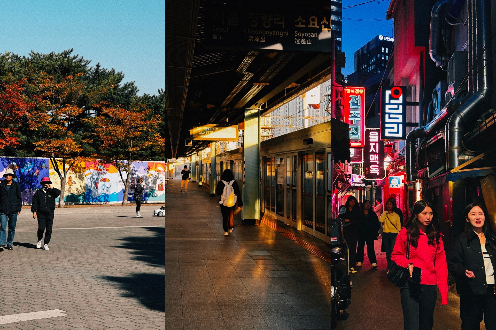
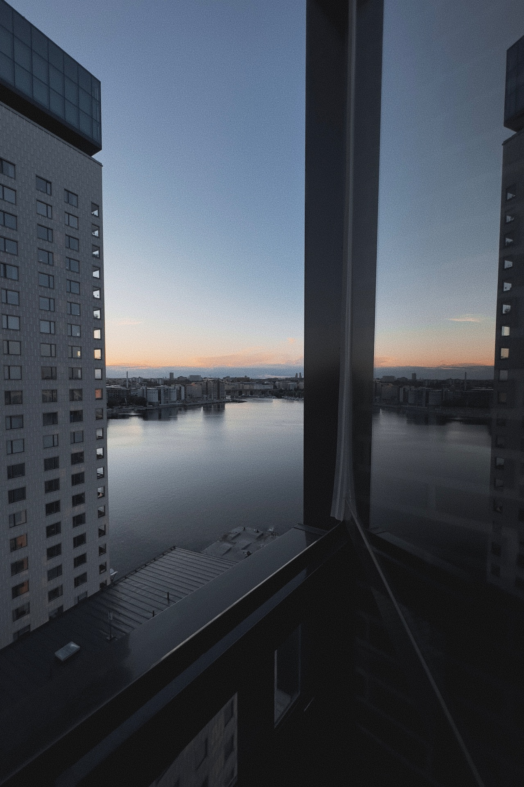

Exactly one year ago, I was in the midst of my biggest adventure so far. For the first time ever in my life, I was living on my own for a month, in a foreign place, in a foreign country: Seoul, in South Korea.

These past few days, I’ve looked through photos from this time with a warming feeling of nostalgia. And It got me thinking about cities I once visited, that I want to visit again someday.

In no particular order, here are my current top 3:

## Seoul, KR
Let’s start with the obvious contender, Seoul. I’ve never stayed longer in one place abroad, so naturally, you develop some feelings for that place.

In the first few days, arriving (both physically and mentally) proved to be quite a challenge for me – I’ve never been outside of Europe before, let alone, in a country where I could neither speak nor read the language. But as you probably know if you’ve also travelled to such a place before, somehow, you can still find your way around.

Apart from the challenging moments, there were also a ton of beautiful ones. I mostly like to think about those ordinary daily moments. Like my (almost) daily walk in the late afternoon, where I would head in the direction of [Yeouido](https://en.wikipedia.org/wiki/Yeouido) (an island on the Han river) to find a restaurant to eat. I loved the anonymity of just walking along a familiar route in an unknown but exciting place while listening to a podcast or [songs I still connect with that walk](https://open.spotify.com/track/0fdfXWcW9BFBGsdk7fh0B5). There was nothing special about that walk from the outside, but to me, this route is one of my Seoul core memories.

On two or three occasions, I would also take the metro to a different part of the city and walk along the [Cheonggyecheon stream](https://english.seoul.go.kr/cheonggyecheon-stream-3/). In a bustling metropole like Seoul, this little this park, which meandered through the city with the stream, was a great place to wind down.

I still miss some of my favorite comfort foods I would eat multiple times a week, like [Gimbap](https://en.wikipedia.org/wiki/Gimbap) or the cookies from that small little pastry shop in my neighborhood.

Seoul was far too big for me to explore in this one month, so I would love to head over there again in the future and continue my journey where I left off. But this time, preferably with someone else to share the experience with.

## Stockholm, SE
I’ve always loved the calm and laidback vibe of Scandinavian cities. I might be influenced by the portrayal of them in pop culture, but to me, they seem like a gorgeous place to live in (well, maybe except when I read some Nordic noir thriller). Not too dissimilar from Swiss cities, but somehow more exciting (perhaps because they don’t feel as familiar to me).

Stockholm was the first of these cities I visited and also the first proper vacation with my girlfriend, so it holds a special place in my heart.

We stayed in the beautiful Liljeholmen area in a great apartment, sandwiched between water and a park. It was the perfect place for a relaxing vacation.

Two places that come to mind when I think about this holiday in Stockholm are the [Vasa museum](https://www.vasamuseet.se/en) (one of the best and most impressive museums I’ve ever been to) and the public library with its beautiful architecture.

If I ever decide to study abroad for a semester, Stockholm is definitely a top contender!

## Brighton, GB
Brighton is the only city on this list that I’ve actually already visited twice.

The first time was in 2019 as part of a voluntary language stay during my apprenticeship. Since we were quite a big group of Swiss people in that language school, we didn’t really improve our language skills. But the experience was still great!

I lived in Hove with my host mom and a Turkish roommate. Both were very nice people, but I especially enjoyed the talks with my host mother, who would regularly talk to me about the history of Brighton or what was currently going on in the country (while watching the morning news on TV). This connection with a local absolutely enriched the stay.

Two other memories that immediately come to mind are the student parties on Wednesday at the [Pryzm club](https://pryzm.co.uk/brighton/) and the walks along the promenade.

In 2023, I visited Brighton again with two friends who were also part of the original 2019 trip, and we visited some of these places once more. It felt like a trip down memory lane.

I’ve been to more cities that I would love to visit again, but these are definitely my favorites. What about yours?
