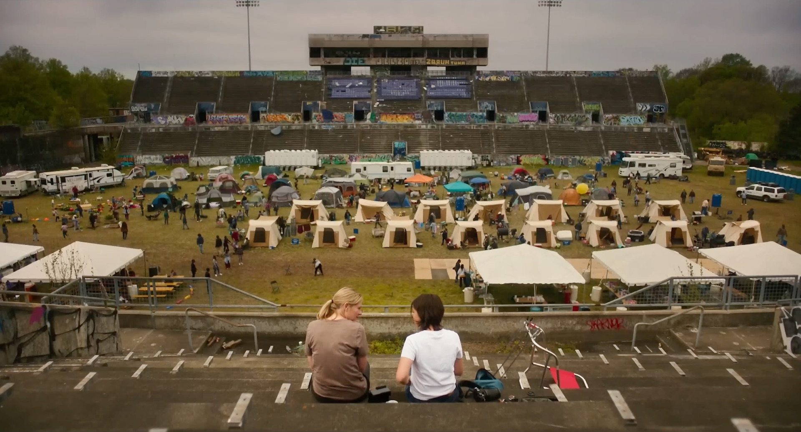

Civil War is a movie that has been on my “to watch” list since it came out this spring. Unfortunately, it wasn’t available to stream anywhere here in Switzerland, so I recently took the plunge and actually bought the movie on iTunes (something I haven't done in a very long time). But buying a movie makes you appreciate it more. And it was worth it.

To be frank, I initially felt the premise of the movie was intriguing because it seemed like a work of speculative fiction that explores an interesting scenario. A story that is set just a couple of years into the future of our present. At that time, the world is even more divided than now. And the USA is in a full scale civil war. Sounds scarily realistic but also intriguing, right? So I wondered how the film would execute on that controversial plot idea, what would it look like, who fights against whom, why do they fight in the first place, and who wins in the end? You get the gist.

Additionally, it's an A24 production. Always a great stamp of quality.

Anyways, as I headed into the film, I was immediately drawn in. Not because of the story, though. But because of the visuals. Civil War is one of those movies, where you can essentially pause it in an arbitrary place and the frame on screen is just a piece of art.

It also helps that the main protagonists are war photographers from three different generations. As they always have their cameras on them during combat scenes, the movie makes use of the pictures taken in a visually interesting way. Immediately after a photo is taken, it’s shown for a few seconds – sometimes even in Black and White, depending on who took it. Sure, all the shots are very brutal, but there is some artistic “beauty” (if you can call it that) of capturing these moments, frozen in time.

The youngest reporter used an analog camera, which once more reinforced my desire to shoot analog as well. I've [written about it briefly in the past](/capturing-vs-living), but this movie was one further nudge to push me into that direction. We'll see where this journey goes.

The music stood out as well, although more because it almost felt ironic in the context of what was going on. You'd see citizens in military uniforms killing each other while some happy tunes were playing in the background. Nevertheless, it was a perfect choice, highlighting the futility of the conflict. It's just brutal, and no one really wins.

This sentiment was further enforced when I looked up some analyses (as I always tend to do after watching an interesting movie). Many commenters expected a classic (anti-)war movie, where the “good guys” fight against the “bad ones”, where you get to learn about the background of the war and why it happened. Kinda like I did in the beginning. But the story isn't really the point of this film.

All the events are presented in a very neutral way, through the lenses of the war reporters. The only obvious bad guy is the president. But apart from that, the story actually doesn't matter that much. It's just people killing each other in different places at different times along the journey. People who knew each other before, and, in one instance, even went to high school together. It's all so sad and pointless.

However, that's precisely the point, Civil War tries to make.

4.5/5

Watched: 09.08.2024
