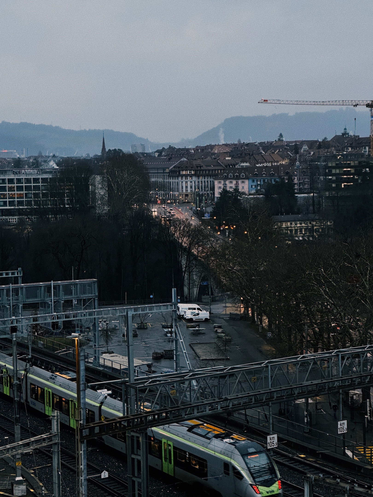

Today, I was reminded once again of how great the early hours of a day can feel.

As I’m currently preparing for my last two (but unfortunately hardest) exams of the semester, I got up early to be at the university library as soon as it opened.

Apart from the “getting out of bed” part of said plan, this always turns out to be an excellent choice.

From where I live, I have to walk around 10 minutes to the train station and then commute for another 20 minutes until I arrive in Bern. This whole 30-minute long journey is always beautiful in the early morning. The village is mostly asleep, only a few cars drive through the streets, it’s chilly, and you can sometimes still see the stars.

There are also significantly fewer commuters on this particular train I usually take than on the subsequent ones. No searching for an empty seat, just sitting down where I want. People are still tired, so no one is talking loudly either, perfect for some reading or just listening to music.

In the library, the headlights aren’t even all turned on at this time, only the ones that are necessary to guide your way to a desk. This means that you get to use the desk lamps, which adds an extra bit of study atmosphere.

After about an hour of studying, I take my first break and head outside to catch some fresh air. This is the absolute best part of the plan:

I get to watch the city slowly waking up.

This view always feels like a reward for waking up early. And having moved one step closer to a goal of mine already.
