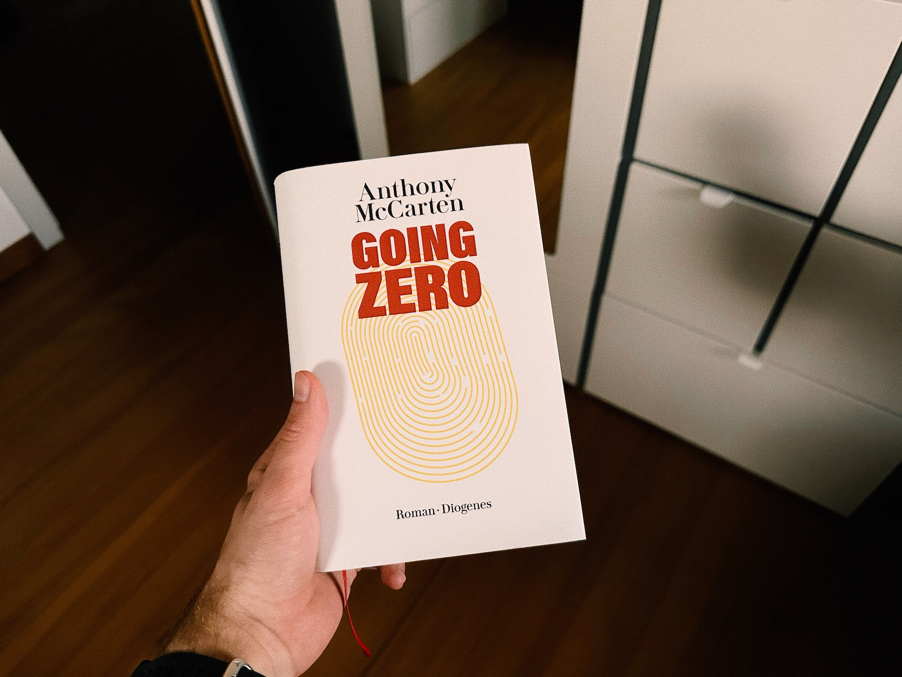

Going Zero by Anthony McCarten is a book that has been on my TBR list for the longest time. Recently, I finally got to read it.

To keep things short, it was my favourite fiction read of the year to date. 5/5 stars, no question. And if you have a similar taste to mine, you’ll like it as well.

The premise of the book already sounds intriguing: A big tech company (very Meta-like) collaborates with the CIA to create “Fusion”. A tool that promises to be able to track down any citizen anywhere in the world. Basically, the best surveillance program that has ever existed.

To test it, the company has selected 10 random people who are tasked with disappearing for 30 days. If they remain undiscovered, they win 3 million $. We get to meet all of these ten “Zeros”, but the most important one is Kaitlyn Day, an inconspicuous librarian from Boston. Will she be able to stay under the radar for the full month?

If you think this plot has “Catch Me If You Can” vibes, you’re right. But it feels (and is) way more techy, which suits my taste. And with all the technology that is readily available in our world today, the whole scenario seems plausible (who knows, maybe Fusion exists already?). Even real companies like Google or Amazon are mentioned regularly and Cy Baxter (the CEO of WorldShare, the company behind Fusion) is portrayed like a mixture between Mark Zuckerberg and Elon Mask. This only adds to the realism I felt when reading it.

Anthony McCarten is an Academy Award-nominated screenplay writer, and you feel that on every page. The sentences are really short, so are the chapters. Almost every chapter catapults the reader between the two locations: A Zero on the run and Cy Baxter in the HQ. You can _feel_ the clock ticking down (the chapters are even titled with the remaining time) and the suspense builds up from page to page without any real downtime.

If that already intrigued you, definitely give it a read. And without wanting to spoil you – be ready for a big twist in the middle of the book. It makes the story even better. And demonstrates, how intelligent the characters in this story are.

Last but not least, since I’m a sucker for beautiful book covers, look at the cover art for the German edition I read:

Perfection!
