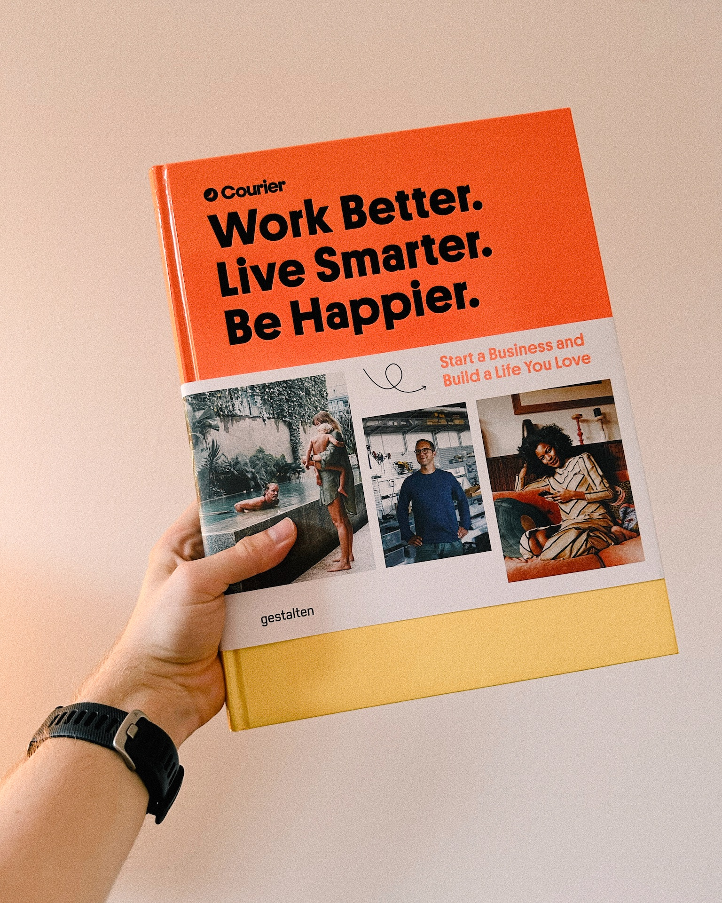

Although it’s just a short one, [Alexandra’s post about reading (or not reading) books](https://alexandrawolfe.ca/to-read-or-not-to-read/) resonated with me for two reasons.

First and foremost, this is very relatable:

> So why have I got over 50 books sat on the coffee table gathering dust. Why is it I can't just pick one up and start reading?

If I stopped buying books today, I would still have enough material to read for the next two years. After all, _buying_ books and _reading_ books are two different hobbies. It’s not as bad as it used to be, though. This year to date, I already read 18 books, which is 2 more than I read in 2023 and double of what I read in 2022. Still, I have bought more than 18 books this year.

But maybe this is just a somewhat natural thing that happens when you love the medium book, but reading is not your No. 1 priority in life? I mean, having a collection of books that you never read cover to cover but that just bring you joy, that you can flip through just for fun and discover something new every time is fantastic. That’s also the reason I am a sucker for coffee table books.

On the contrary, I find it fascinating how Alexandra has no problem getting words out on the page and blogging regularly (if not daily). Because I would say that I have the opposite struggle: Reading has become a daily habit by now. Especially since focusing more on fiction than non-fiction books. But writing… Writing is way harder for me.

Maybe it’s because English is not my native language? Maybe [I am being too much of a perfectionist](/fighting-perfectionism) and not allowing myself to just write about whatever, however? Or will the organic flow of writing maybe only kick in after writing for a way longer time than I already do?

I don’t know.

And so, I read. I read a lot. But write?

Maybe tomorrow.

This post is part of the **\#JulyReply2024** challenge. More information in this post: [Replies are this month’s comments](/july-reply-2024).
