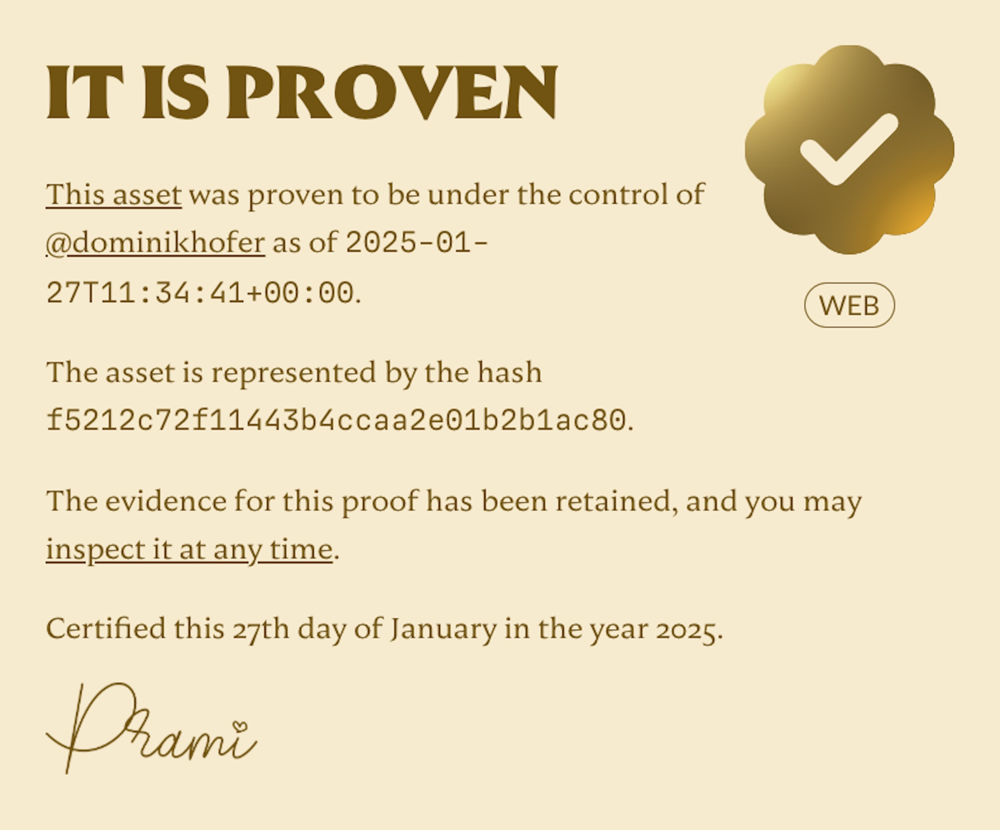

After building my own personal home on the internet (you’re visiting it right now, hi 👋), I think I finally found my social home as well.

Ok, that sounds a bit dramatic. But I am now a part of omg.lol, the proud owner of the “[best internet address that I’ve ever had](https://home.omg.lol/)” and a new member of a pretty cool and wholesome Mastodon instance, [social.lol](https://social.lol/).

This means that I also had to leave my old instance, mastodon.design. The switch was pretty easy, thanks to [this great video by Matt](https://www.youtube.com/watch?v=XHK1iXdpvg8). But I got asked a couple of times for the reasons behind the switch. So I thought I’d quickly share, why I chose to move to social.lol. Or rather, why I think it’s a cool project and community worth supporting.

First of all, omg.lol is pretty difficult to describe. You essentially get an omg.lol subdomain that comes with a bunch of little tools and additional perks. Things like a kind of [“link-in-bio” page](https://dominikhofer.profile.lol/), [email forwarding](mailto:dominikhofer@omg.lol), a [status log](https://status.lol/), and so on. But honestly, I just like the vibes of it. It feels equally nerdy, friendly and has big IndieWeb energy.

The main reason I wanted to join though was their Mastodon instance. Plenty of people whose personal blogs I follow are on there, so it felt like a great community to be a part of. And having to pay a small fee of $20 per year to be on there has two big advantages in my opinion:

Everyone in the community contributes financially towards the operating costs of the server, which feels like a very sustainable model compared to other servers. And the quality of posts on the instance itself is notably higher compared to more general instances because people on social.lol explicitly want to be on there.

Granted, my former server mastodon.design also had some great people on there and is generally well run. But one thing that bugged me recently was their choice to completely block (or “defederate”) threads.net on a server level. Adam (the creator of omg.lol) wrote a great article about [why that might not be the best idea](https://notes.neatnik.net/2025/01/framing-federation).

And I agree, this goes against my idea of an open social web as well. Just because the Meta executives have made horrible decisions lately doesn’t mean that I want someone else to block _all_ the people on Threads _for_ me[^1]. Let the users be in charge!

Apart from the Mastodon server, as already mentioned, omg.lol offers a lot more than just that. For example, you can also prove your ownership of a domain and get a timestamped certificate like this:

Is this a legal document? No.

Is it still a cool way to verify stuff? Hell yeah!

Everything on omg.lol has this kind of energy to it. And everything is open and can be controlled by an API, which is also nice. I’m currently rebuilding this website and might integrate one or two omg.lol features, stay tuned.

If you’ve read this far, I highly encourage you to check out [omg.lol](https://home.omg.lol/referred-by/dominikhofer) yourself.

And to Adam, thanks for creating such a wonderful nerdy place on the internet :)

[^1]:	I still want to read [Hank Green’s posts](https://www.threads.net/@hankgreen)!
